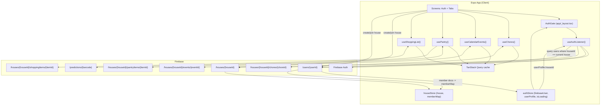

# Homie

A mobile app for college students in shared housing. Homie replaces the group chats, spreadsheets, and sticky notes with one organized home base for your household.

---

## Features


| Feature             | Description                                                                   |
| ------------------- | ----------------------------------------------------------------------------- |
| **Chore tracker**   | Weekly chores assigned to roommates, mark complete, recurring schedules       |
| **Shared calendar** | Weekly view color-coded by roommate, add household events                     |
| **Pantry tracker**  | Track food items with expiration dates, barcode scanning, shared vs. personal |
| **Shopping list**   | Shared checklist grouped by category, real-time updates for all roommates     |
| **Home dashboard**  | Fridge-magnet style overview of today's chores, events, and expiring items    |


---

## Tech Stack


| Layer            | Choice                                        |
| ---------------- | --------------------------------------------- |
| Framework        | Expo SDK 54 (managed workflow)                |
| Language         | TypeScript                                    |
| Navigation       | Expo Router v3 (file-based)                   |
| Database         | Firebase Firestore (real-time NoSQL)          |
| Auth             | Firebase Authentication                       |
| Global state     | Zustand                                       |
| Server state     | TanStack Query (wraps Firestore `onSnapshot`) |
| Forms            | react-hook-form + zod                         |
| Camera / barcode | expo-camera                                   |
| Notifications    | expo-notifications                            |


---

## Project Structure

```
Homie/
├── app/                        # Expo Router file-based routes
│   ├── _layout.tsx             # Root layout — auth gate, QueryClient provider
│   ├── (auth)/
│   │   ├── login.tsx
│   │   ├── signup.tsx
│   │   └── join-house.tsx      # Enter invite code or create a new house
│   └── (tabs)/
│       ├── index.tsx           # Home dashboard
│       ├── chores.tsx
│       ├── calendar.tsx
│       ├── pantry.tsx
│       └── shopping.tsx
│
├── src/
│   ├── types/                  # TypeScript interfaces for all Firestore entities
│   ├── firebase/
│   │   ├── config.ts           # Firebase app init (reads from .env)
│   │   ├── auth.ts             # signUp, signIn, signOut helpers
│   │   └── firestore.ts        # Typed collection refs with FirestoreDataConverter
│   ├── store/
│   │   ├── authStore.ts        # Zustand: current user + loading state
│   │   └── houseStore.ts       # Zustand: house info + roommate color/name map
│   ├── hooks/                  # useAuth, useChores, useCalendarEvents, usePantry, useShoppingList
│   ├── services/               # External APIs: Google Vision, OpenAI, Google Calendar
│   ├── components/             # Shared UI and feature-specific components
│   └── utils/                  # weekKey, colors, categories, nanoid
│
└── functions/                  # Firebase Cloud Functions (Node.js)
    ├── dailyChoreReset.ts      # Advances each house's recurring chores nightly (00:01 PT)
    └── expirationAlerts.ts     # Checks pantry daily, sends push notifications
```

---

## Firestore Data Model

```
/users/{userId}
  email, displayName, avatarUrl, houseId, color (#hex), createdAt

/houses/{houseId}
  name, inviteCode (6-char), memberIds[], memberNames{ userId: displayName }, createdBy, createdAt

/houses/{houseId}/chores/{choreId}
  title, assignedTo (userId), recurrence, dayOfWeek, isCompleted,
  weekKey ("2026-W15"), createdBy, createdAt

/houses/{houseId}/events/{eventId}
  title, description, startTime, endTime, createdBy,
  color (denormalized from user), googleEventId, createdAt

/houses/{houseId}/pantryItems/{itemId}
  name, barcode, quantity, unit, expirationDate, expirationConfidence,
  isShared, ownedBy (userId), category, addedBy, createdAt

/houses/{houseId}/shoppingItems/{itemId}
  name, category, quantity, unit, isChecked, addedBy, checkedBy, createdAt

/predictions/{barcode}          ← cached GPT-4o expiration predictions
  estimatedDays, range, category, cachedAt
```

Key design decisions:

- `weekKey` on chores (e.g. `"2026-W15"`) lets you query this week's chores with a single `==` filter — no date range math needed
- `color` is copied onto events at write time so the calendar can render without a join
- `inviteCode` on houses lets anyone join with a 6-character code
- `memberNames` on houses is a denormalized map for fast label rendering (`userId -> displayName`), while `/users/{userId}` remains the source of truth for full profiles

---

## App Data Flow




### User and house relationship

- `/users/{userId}.houseId` points to the user's active household.
- `/houses/{houseId}.memberIds[]` lists member user IDs.
- `/houses/{houseId}.memberNames` stores denormalized display names for quick UI reads.
- You can derive basic member identity from the house doc (`id + displayName`), but full profile data (color, avatar, email, latest profile state) should still come from `/users/{userId}`.

---

## Getting Started

### 1. Prerequisites

- Node.js 18+
- A Firebase project (free Spark tier is fine)

### 2. Clone and switch to the demo branch

> **Important:** Run from the `PhoneDemo` branch, not `main`. `main` is the raw development branch and may be unstable.

```bash
git clone https://github.com/TravisHaa/CL_Homie.git
cd CL_Homie
git checkout PhoneDemo
npm install
```

### 3. Firebase setup

The app requires a Firebase project for authentication and data storage. Firebase has a free tier (Spark plan) that is more than enough to run Homie.

**Create a Firebase project:**

1. Go to [console.firebase.google.com](https://console.firebase.google.com) and sign in with a Google account
2. Click **Add project**, give it any name (e.g. `homie-local`), and follow the prompts
3. Inside the project, go to **Build → Authentication** → **Sign-in method** → enable **Email/Password**
4. Go to **Build → Firestore Database** → click **Create database** → choose **Start in test mode**
5. Go to **Project Settings** (gear icon) → **Your apps** → click **Add app** → choose the **Web** platform (`</>`)
6. Register the app (any nickname) — Firebase will show you a config object like this:

```js
const firebaseConfig = {
  apiKey: "AIzaSy...",
  authDomain: "your-project.firebaseapp.com",
  projectId: "your-project",
  storageBucket: "your-project.appspot.com",
  messagingSenderId: "123456789",
  appId: "1:123456789:web:abc123"
};
```

### 4. Configure environment variables

```bash
cp .env.example .env
```

Open `.env` and paste in the values from your Firebase config:

```
EXPO_PUBLIC_FIREBASE_API_KEY=AIzaSy...
EXPO_PUBLIC_FIREBASE_AUTH_DOMAIN=your-project.firebaseapp.com
EXPO_PUBLIC_FIREBASE_PROJECT_ID=your-project
EXPO_PUBLIC_FIREBASE_STORAGE_BUCKET=your-project.appspot.com
EXPO_PUBLIC_FIREBASE_MESSAGING_SENDER_ID=123456789
EXPO_PUBLIC_FIREBASE_APP_ID=1:123456789:web:abc123
```

The `EXPO_PUBLIC_GOOGLE_VISION_API_KEY` and `EXPO_PUBLIC_GOOGLE_OAUTH_WEB_CLIENT_ID` fields are optional — leave them blank and the core app works fine.

### 5. Run on web

```bash
npm start
```

When the Expo dev server starts, press **`w`** to open the app in your browser. It will be available at `http://localhost:8081`.

The app automatically displays in a phone-sized frame (Samsung Galaxy S20 Ultra dimensions) centered on a dark background — no browser dev tools or device emulation needed.

### 6. Push notifications (one-time setup, physical device only)

Push notifications require an EAS project ID. This is a **one-time step** — once it's in `app.json` you never run it again.

```bash
npm install -g eas-cli   # install EAS CLI (skip if already installed)
eas login                # log in with your Expo account
eas init                 # links the project and writes projectId into app.json
```

After `eas init`, `app.json` will contain:

```json
"extra": {
  "eas": { "projectId": "your-project-id" }
}
```

Then test on a real device (push tokens don't work in simulators or on web):

1. `npm start` → scan QR with **Expo Go**
2. Log in — the app will request notification permission automatically
3. Check Firestore: `users/{uid}/devices/{deviceId}` should have a non-null `expoPushToken`
4. Create a calendar event and assign it to a roommate → they'll receive a push: **"[your name] added you to an event"**

> **Note:** Without the EAS project ID the app still runs normally — push registration is silently skipped with a console warning. You only need this setup when testing notifications specifically.

---

## External APIs


| API                       | Purpose                                                    | Key location                                        |
| ------------------------- | ---------------------------------------------------------- | --------------------------------------------------- |
| Firebase Auth + Firestore | Auth and database                                          | `.env`                                              |
| Open Food Facts           | Product name + category from barcode (free, no key needed) | None                                                |
| Google Vision API         | Label detection for non-barcoded items                     | `.env`                                              |
| OpenAI GPT-4o             | Expiration date prediction                                 | Firebase Cloud Functions env only — never in client |
| Google Calendar           | Calendar sync (Phase 2)                                    | Firebase Cloud Functions env only                   |


> **Important:** OpenAI and Google Calendar secrets must only be set in Firebase Cloud Functions environment variables (`firebase functions:config:set ...`). Never put them in `.env` — they would be exposed in the app bundle.

---

## Current Status

- Expo + TypeScript scaffold
- Firebase config and Firestore typed collection refs
- Auth screens (login, signup, join/create house)
- Tab navigation with auth gate
- Zustand stores (auth, house)
- All TypeScript types defined
- Chores feature (`feature/chores` branch)
- Calendar feature (`feature/calendar` branch)
- Pantry feature (`feature/pantry` branch)
- Shopping list feature (`feature/shopping` branch)
- Home dashboard (`feature/home` branch)
- Firebase Cloud Functions (weekly chore reset, expiration alerts)
- Push notifications
- Google Calendar sync (Phase 2)

